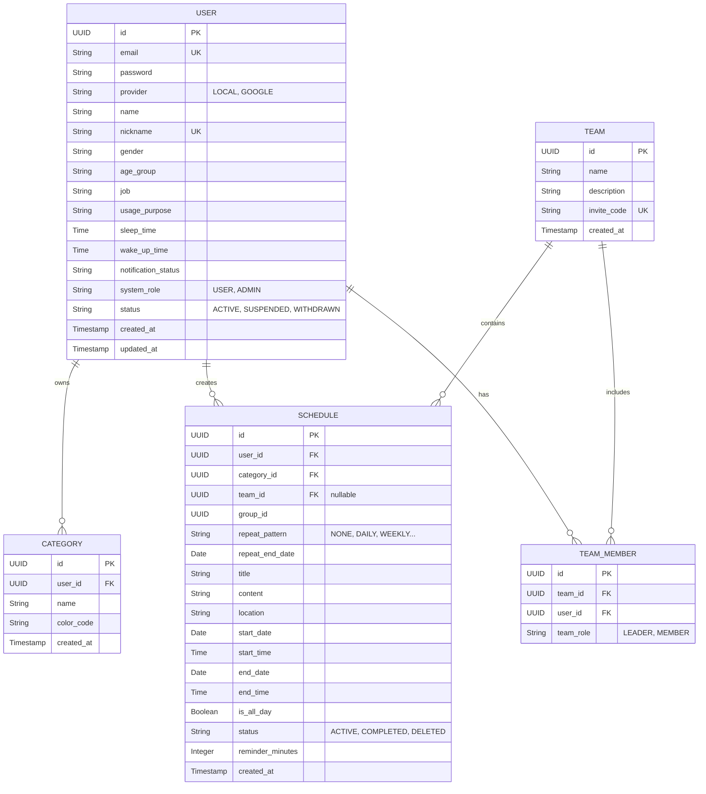
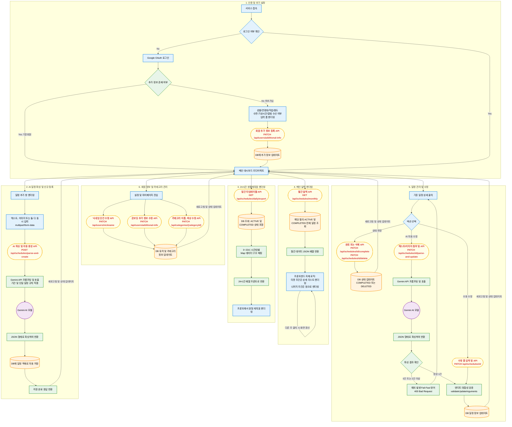
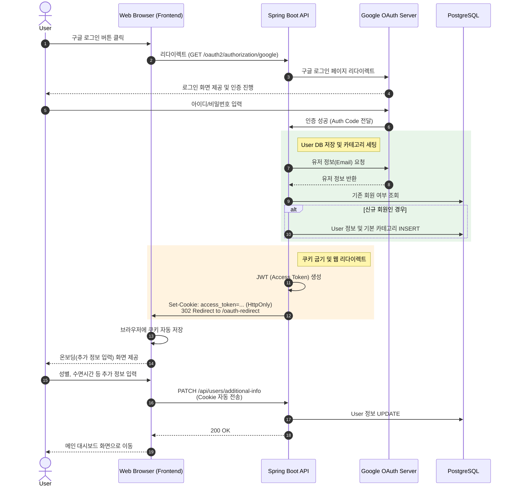
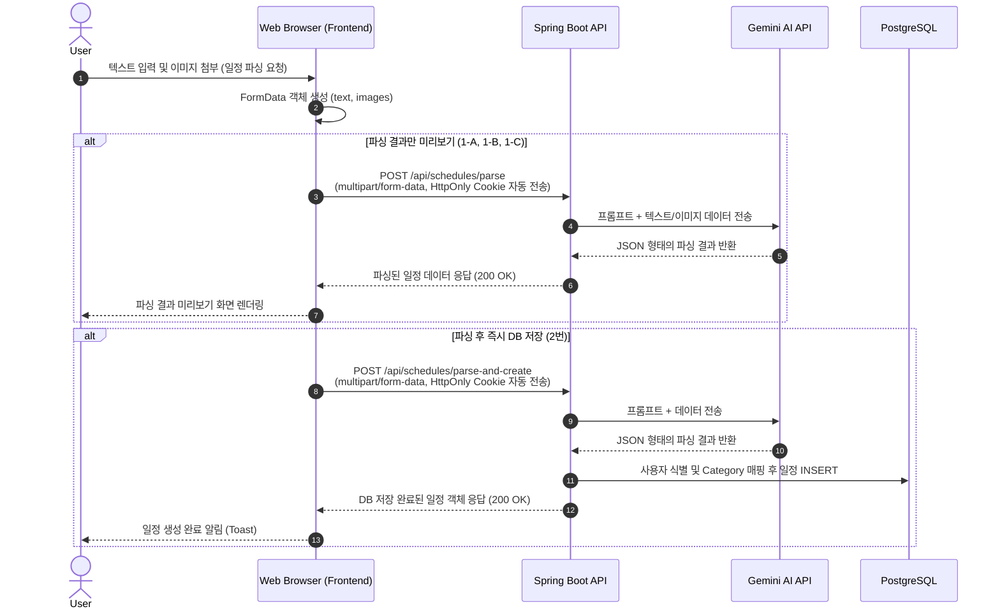
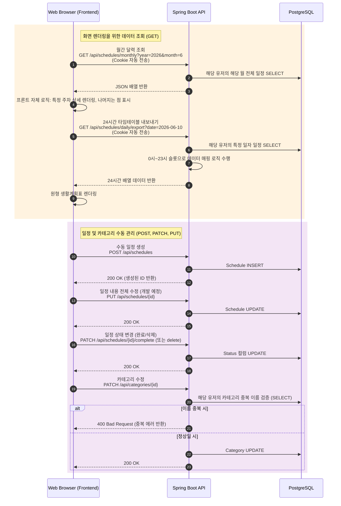

  <h1>📅 PF-eZplan Core Service</h1>
  
사용자 자연어 입력 및 이미지 인식을 통한 지능형 스케줄링 시스템

## 📖 Introduction

**eZplan**은 복잡한 일정 등록 과정을 AI로 자동화하고 관리해 주는 스마트 캘린더 백엔드 서비스입니다. 텍스트나 이미지를 전송하면 AI가 문맥을 분석하여 일정을 자동으로 파싱 및 분류하며, 구글 OAuth2
기반의 안전한 인증을 제공합니다.

### ✨ Key Features (현재 구현 완료)

- **AI 지능형 파싱:** Gemini 3.1 Flash-Lite를 활용하여 자연어 및 이미지에서 일정(날짜, 시간, 장소, 목적) 자동 추출
- **반복 일정 자동화:** 대학 시간표(학기 기준일 계산), 매주 회의 등 주기적인 반복 일정 자동 세팅
- **맞춤형 온보딩:** 사용자 직업, 수면 시간 등을 반영한 커스텀 유저 프로필 관리
- **보안 및 인증:** Google OAuth2 및 HttpOnly 쿠키 기반의 JWT 인증 처리

---

## 🏗 System Architecture

- **4-Layer Architecture:** Web (Controller) → Service → Domain (Entity) → Infrastructure (Repository)
- **RESTful API:** 프론트엔드(Web)와 완전히 분리된 클라이언트-서버 아키텍처

---

## 🗄 Database Schema (ERD)

공통 추상화 클래스(`BaseEntity`)를 포함한 eZplan의 핵심 데이터베이스 설계입니다.

---

## 🔄 Detailed Workflows (흐름도 및 시퀀스 다이어그램)

> **💡 아래의 각 항목을 클릭하여 상세 다이어그램을 확인할 수 있습니다.**

<b>1. 전체 서비스 플로우차트</b>

 

<b>2. Google OAuth 및 온보딩 시퀀스</b>

 

<b>3. Gemini AI 기반 일정 파싱 및 생성 시퀀스</b>

 

<b>4. 메인 달력, 타임테이블 조회 및 CRUD 시퀀스</b>

 

---

## 🚀 DevOps & CI/CD

- **CI:** GitHub Actions - Gradle Build & Test
- **CD:** Docker Image Push → AWS EC2 SSH Access → Docker Compose Up
- **Infrastructure:** AWS EC2 (t3.micro), RDS (PostgreSQL), S3

---

## 🛠 Tech Stack

  
  
  
  
  
  
  

---

## 📚 API Documentation

본 프로젝트는 무거운 외부 API 문서화 도구(Swagger, Postman) 대신, IDE 내장 **HTTP Client (`.http`)**를 활용하여 API 명세 및 통신 테스트를 코드로 관리합니다.

* **API 테스트 및 명세 파일 위치:** 프로젝트 내 `.http` 확장자 파일 참고 (예: `schedules.http`, `users.http`, `categories.http`)
* **사용 방법:** IntelliJ IDEA 등의 환경에서 해당 파일을 열고, `@auth_token` 등의 환경 변수를 세팅한 뒤 즉시 API 호출 및 스펙 확인이 가능합니다.

---

## 📌 Future Scope & Known Issues (추후 개선 과제)

- **MSA & CQRS 도입:** PostgreSQL(Command/Write)와 Redis/MongoDB(Query/Read) 분리 설계를 통한 읽기 성능 최적화
- **Event-Driven 아키텍처 전환:** 일정 생성 시 AI 파싱 작업 및 푸시 알림 서비스를 비동기 이벤트(Kafka 등)로 발행하여 결합도 낮추기
